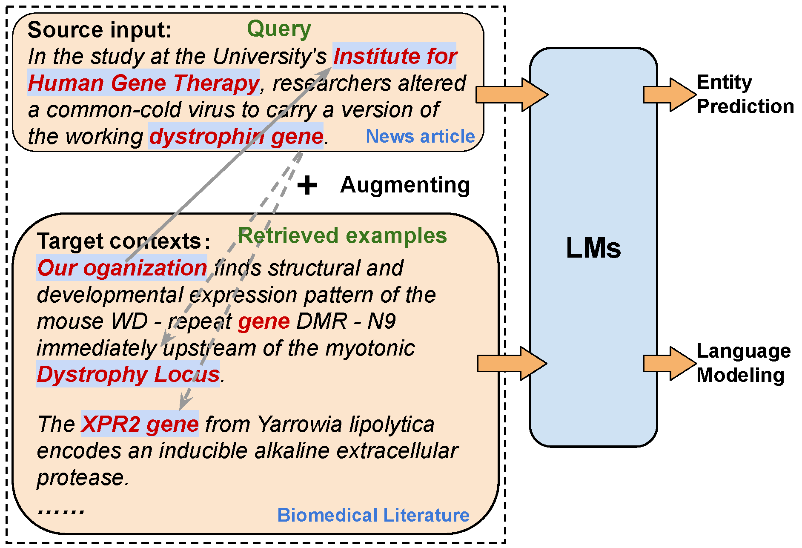

# DAICL
Code for EMNLP 2023 paper [Adapt in Contexts: Retrieval-Augmented Domain Adaptation via In-Context Learning](https://arxiv.org/abs/2311.11551).

We propose to retrieve similar examples from the target unlabeled corpus to serve as the context of a source query and perform adaptive in-context learning by concatenating the source query and target contexts as the input prompt. And we propose a domain-adaptive in-context learning (DAICL) framework for different LM architectures, including encoder-only and decoder-only models.



## Dataset
NER:
- WNUT2016 [Data](https://github.com/aritter/twitter_nlp/tree/master/data/annotated/wnut16)
- CoNLL2003 [Data](https://github.com/synalp/NER/tree/master/corpus/CoNLL-2003) [Other](https://nlp.stanford.edu/projects/project-ner.shtml)
- Financial NER [Data](http://people.eng.unimelb.edu.au/tbaldwin/resources/finance-sec)
- WNUT2017 [Data](https://noisy-text.github.io/2017/emerging-rare-entities.html)
- BioNER [Data](https://github.com/cambridgeltl/MTL-Bioinformatics-2016)
- You can also download our processed NER data [Here](https://drive.google.com/file/d/1JsRG7RirgjTyx0q1oBT3O2yfaE9kG-wB/view?usp=sharing)

SA:
- Amazon Benchmark 2-classes [Data](
https://www.cs.jhu.edu/~mdredze/datasets/sentiment/)
- Amazon Review 3-classes [Data](https://github.com/ruidan/DAS)
- You can also download our processed SA data [Here](https://drive.google.com/file/d/1JyKL0WXzX311N7HQYEFLy69K0UPueN5i/view?usp=sharing)

## Retriever
[SimCSE](https://github.com/princeton-nlp/SimCSE)

[BertScore](https://github.com/Tiiiger/bert_score)

```bash
python NER_Datasets/retrieval_cross_domain.py
```

## Run
Train LLaMA:
```bash
CUDA_VISIBLE_DEVICES=0 python finetune_new.py \
    --base_model 'yahma/llama-7b-hf' \
    --data_path 'NER_Datasets/llama_train_data/gold_demo/wnut16_gold_demo.json' \
    --output_dir 'model/ner_conll03-wnut16_gold_demo_lr3e-4_r16_alpha16_toi_aet_0' \
    --batch_size 256 \
    --micro_batch_size 4 \
    --num_epochs 5 \
    --learning_rate 3e-4 \
    --cutoff_len 512 \
    --val_set_size 1000 \
    --warmup_steps 20 \
    --logging_steps 4\
    --eval_steps 50 \
    --save_steps 50 \
    --lora_r 16 \
    --lora_alpha 16 \
    --lora_dropout 0.05 \
    --lora_target_modules '[q_proj,k_proj,v_proj,o_proj]' \
    --train_on_inputs \
    --add_eos_token
```

LLaMA Inference:
```bash
CUDA_VISIBLE_DEVICES=1 python eval_generate.py \
    --load_8bit \
    --base_model "yahma/llama-7b-hf" \
    --lora_weights 'model/ner_conll03-wnut16_gold_demo_lr3e-4_r16_alpha16_toi_aet_0' \
    --eval_path  "NER_Datasets/llama_inf_data/gold_demo//wnut16_gold_demo.json" \
    --eval_result_path "NER_Datasets/llama_inf_data/eval_result/ner_conll03-wnut16_gold_demo_lr3e-4_r16_alpha16_toi_aet_0/wnut16_gold_demo.txt" \
    --eval_batch_size 3
```

Run Roberta NER
```bash
CUDA_VISIBLE_DEVICES=0 python roberta_ner/train.py \
    --config config/conll03-wnut16_cl_kl.yaml
```

## Citing
Please cite the following paper if you found the resources in this repository useful.
```
@inproceedings{long-etal-2023-adapt,
    title = "Adapt in Contexts: Retrieval-Augmented Domain Adaptation via In-Context Learning",
    author = "Long, Quanyu  and
      Wang, Wenya  and
      Pan, Sinno",
    editor = "Bouamor, Houda  and
      Pino, Juan  and
      Bali, Kalika",
    booktitle = "Proceedings of the 2023 Conference on Empirical Methods in Natural Language Processing",
    month = dec,
    year = "2023",
    address = "Singapore",
    publisher = "Association for Computational Linguistics",
    url = "https://aclanthology.org/2023.emnlp-main.402",
    pages = "6525--6542",
}
```

## Acknowledgement
This project is implemented based on [alpaca-lora](https://github.com/tloen/alpaca-lora) and [CLNER](https://github.com/Alibaba-NLP/CLNER) source code